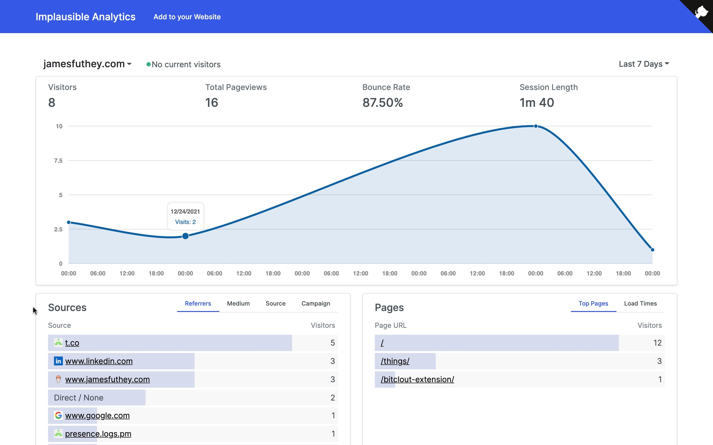

# Implausible Analytics (Vue 3)

A toy application in Vue 3 that tracks and reports on user behavior, using `sql.js-httpvfs`.

## Demo 

https://implausible.serv.rs/?range=7

## Backend, previous frontend:

https://github.com/kidGodzilla/unsimple-analytics
